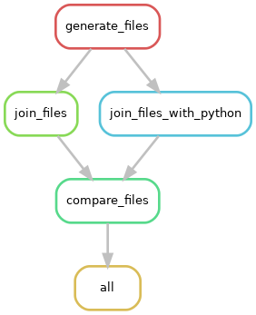

# Introduction to workflow management with Snakemake

[Snakemake](https://snakemake.readthedocs.io) is a workflow management tool to perform a number of related tasks (aka "rules" in Snakemake lingo) in an 
efficient, reproducible and readable way. It uses a simple vocabulary to define expected input, output, parameters, 
script and resources for each rule. In this tutorial, we will go through the following:

- Snakemake vocabulary and syntax
- Constructing a basic workflow with 1 rule
- Various kinds of tasks (shell, R/python scripts, conda environments)
- Parameters, threads, resources
- Passing additional variables in a configuration file
- Wildcards

By the end of the tutorial, we will learn how to build a slightly more complicated workflow with multiple rules, using 
some of the above concepts. 

## Prerequisite knowledge

Some familiarity with Python 3 & basic Conda commands is essential. (e.g. setting up and starting a Conda environment, 
loading python modules, python data types, working with lists, dicts and tuples) There are plenty of resources on the 
web for Python 3, and go [here for an intro to conda](https://docs.conda.io/projects/conda/en/latest/user-guide/getting-started.html).

## Prerequisite software

At a minimum, you should have Conda (Miniconda is fine), and Snakemake installed. Read the [Snakemake docs](https://snakemake.readthedocs.io/en/v3.10.2/getting_started/installation.html)
on how to install these.

I will use bash commands or R scripts in the tutorial, so Linux or MacOS is ideal. For the purpose of this tutorial 
alone, Windows Subsystem for Linux on Windows 10 should work, but may not work reliably.

## How to use this tutorial
I have built up the concepts step-by-step with each individual workflow. Going through them in the following order makes
the most sense. Go through each of the Snakefiles below before running them, to understand Snakemake syntax.
It is not important for you to know the shell commands themselves, as you can substitute them with any other task you like.

First, clone this repo (all code preceded by `$` is to be entered at the terminal (command-line):
```
$ git clone https://github.com/sraorao/snakemake_code_clinic
$ cd snakemake_code_clinic
```
### `Snakefile`
This introduces the concepts of rules, input and output, using shell commands and external scripts and
how to use the `expand()` function. It is easiest to run each rule in this file separately by specifying the rule name 
as follows:
```
$ snakemake -j 1 count_words --dry-run
$ snakemake -j 1 count_words
```
### `Snakefile_3rules.smk`
This file introduces the concept of chaining together a number of rules to create a workflow. We first generate
a file containing a list of letters and another file containing a list of numbers, and join them together using
shell commands or python. We then compare the 2 joined files.



```
$ snakemake --snakefile Snakefile_3rules.smk
```
### `Snakefile_wildcards.smk`
This file introduces the concept of wildcards. When you have many input files with a consist naming pattern
and you want the same tasks done on them, a workflow management software like Snakemake makes your job much easier. 
We created some files in the `data_files/` folder earlier (the `generate_data_files` rule in `Snakefile`) which will
 be used as input for this workflow. The aim is to take each of the 10 text files and edit them and save them in 
 `edited_files/`. 
 Run this file as follows:
```
$ snakemake --snakefile Snakefile_wildcards.smk
```
See if you can make the `input` for rule `all` more concise by using the `expand()` function.

Now, read the TODO section and see if you can write two more rules following the instructions in the Snakefile
and modify `input` for rule `all` accordingly. A possible solution for this can be seen in the `Snakefile_wildcards_solution.smk`
file. 